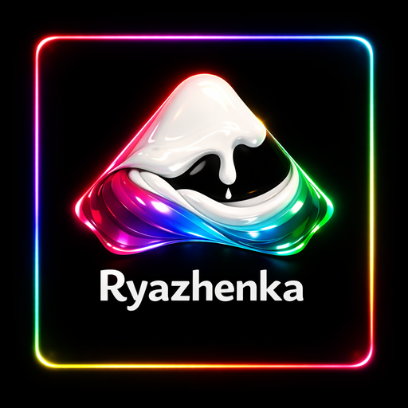

  

# Atmosphère-RYZ (Ryazhenka)

Patched fork of Atmosphère (Nintendo Switch custom firmware).

---

## English (summary)

Atmosphère-RYZ is a fork of [Atmosphère](https://github.com/Atmosphere-NX/Atmosphere),
built on top of Atmosphere-CNX. Differences from the base:

- Boot splash replaced with the Ryazhenka logo (`img/splash.png`, injected into `fusee/package3`).
- Compiled boot logo (in the `boot` module) is also the Ryazhenka logo.
- Chat-style boot loading screen after the splash (typewriter lines + OK).
- AOTag PMC access patch in `exosphere`, ported from
  [Horizon-OC](https://github.com/Horizon-OC/Horizon-OC). PMC access only; no RAM/EMC overclock.
- Version is defined in a single file, `version.txt`. It is shown on-console as
  `Ryazhenka vX.Y.Z` and used as the release name.
- CI: build and release on every push to `main`; a scheduled job opens an
  upstream-sync pull request when upstream Atmosphère changes.

Unofficial patched build. Do not report issues with it to the upstream
Atmosphère, CNX, or Horizon-OC projects.

Component reference documentation: [`docs/main.md`](docs/main.md).

---

## Русский (подробно)

Atmosphère-RYZ (кодовое имя «Ryazhenka», ряженка) — пропатченный форк
[Atmosphère](https://github.com/Atmosphere-NX/Atmosphere), кастомной прошивки для
Nintendo Switch. Собран на базе
[Atmosphere-CNX](https://github.com/CostelaCNX/Atmosphere-CNX);

### Отличия от базы

| Область | Изменение |
|---------|-----------|
| Загрузочный splash | Заменён на логотип Ryazhenka (`img/splash.png`, `img/splash.bin`); встраивается в `fusee/package3` скриптом `utilities/insert_splash_screen.py`. |
| Компилируемый лого | Встроенный в модуль `boot` логотип (`boot_splash_screen_notext.inc`) тоже заменён на полноэкранный логотип Ryazhenka. |
| Экран загрузки | После заставки модуль `boot` показывает экран в чат-стиле: строки печатаются по буквам, после каждой — зелёный «OK». Косметический, без доступа к SD-карте. |
| Патч AOTag | В `exosphere` добавлена таблица доступа `RtcPmcAccessTable` (порт из Horizon-OC), открывающая PMC-регистры для термодатчика aotag. Только PMC; разгон RAM (EMC) не включён. |
| Версия | Задаётся файлом `version.txt`. Подставляется в строку версии на консоли (`Ryazhenka vX.Y.Z`) и используется как имя релиза. |
| CI: сборка | При каждом push в `main` GitHub Actions собирает прошивку и публикует релиз с пометкой о патчах. |
| CI: синхронизация | По расписанию проверяются изменения upstream Atmosphère; при их наличии создаётся pull request для ручного применения. |

### Изменение версии

1. Открыть `version.txt`, указать номер (например, `8.0.1`, без префикса `v`).
2. Закоммитить и запушить в `main`.
3. CI пересоберёт прошивку и опубликует релиз `Ryazhenka v8.0.1`; та же строка
   отобразится на консоли в настройках системы.

### Компоненты

- Fusée — загрузчик первой стадии (RCM payload).
- Exosphère — Secure Monitor (EL3); здесь находится патч AOTag.
- Thermosphère — гипервизор EL2 (в разработке).
- Mesosphère — реимплементация ядра Horizon (EL1).
- Stratosphère — системные модули (EL0).
- Troposphère — патчи уровня приложений.

Подробная документация по компонентам — в каталоге [`docs/`](docs/main.md).

---

## Лицензия

GPLv2 (см. [LICENSE](LICENSE)), с теми же исключениями, что и у оригинальной
Atmosphère. Licensed under GPLv2 with the same exemptions as upstream Atmosphère.

## Происхождение

Atmosphère: SciresM, TuxSH, hexkyz, fincs.
Патч AOTag: [Horizon-OC](https://github.com/Horizon-OC/Horizon-OC).
База форка: [Atmosphere-CNX](https://github.com/CostelaCNX/Atmosphere-CNX).
Atmosphère-RYZ применяет описанные изменения поверх их работы.
